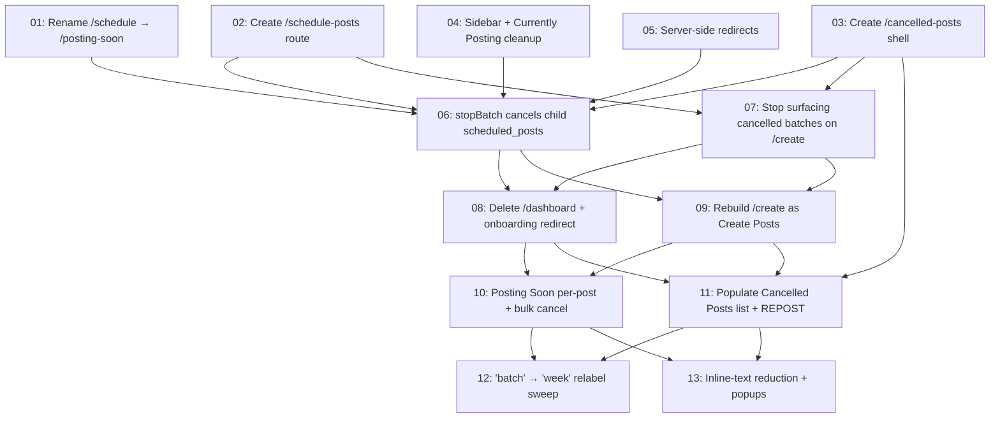

# Navigation Redesign

## Overview

Reshape UniqueMe's left sidebar and page set into a single linear story (Create Posts → Schedule Posts → Posting Soon → Cancelled Posts), delete the dashboard, retire the dormant Currently Posting page, build a real Cancelled Posts page as ONE list of individual cancelled posts (per-post cancels AND whole-batch cancels both surface as individual rows), add per-post and bulk cancel to the scheduled view, and convert the trial gate from a full-page block into a click-time modal. No underlying logic changes — generation, review, edit, regenerate, and schedule all keep working exactly as today, just on renamed routes with a calmer presentation.

## Quick Links

- [Requirements](./requirements.md) — full requirements and acceptance criteria
- [Action Required](./action-required.md) — manual steps needing human action (none for this feature)

## Dependency Graph

## Waves

| Wave | Tasks | Description |
|------|-------|-------------|
| 1 | task-01, task-02, task-03, task-04, task-05 | Route renames + new shells + sidebar reshape + Currently Posting retirement. App still works; /cancelled-posts is an empty single-list shell. |
| 2 | task-06, task-07 | Data prep for single-list Cancelled Posts: stopBatch flips child scheduled_posts to cancelled too; verify /create no longer surfaces cancelled batches. |
| 3 | task-08, task-09 | Delete /dashboard, redirect root + onboarding to /create, strip /create to single-button + 3 stats, add click-time trial Dialog. |
| 4 | task-10, task-11 | Per-post + bulk cancel on Posting Soon; populate the single Cancelled Posts list (per-post + batch-cancelled posts mixed); REPOST action with two-option Dialog ("natural fit" \| "pick a date"). |
| 5 | task-12, task-13 | "Batch" → "Week" relabel in friendly copy (quota copy untouched); reduce inline explanatory text, lift to popups/tooltips where useful. |

## Task Status

### Wave 1
- [ ] [task-01-rename-schedule-to-posting-soon](./tasks/task-01-rename-schedule-to-posting-soon.md) — Move /schedule files to /posting-soon
- [ ] [task-02-create-schedule-posts-route](./tasks/task-02-create-schedule-posts-route.md) — New /schedule-posts list + [batchId] detail
- [ ] [task-03-create-cancelled-posts-shell](./tasks/task-03-create-cancelled-posts-shell.md) — Empty /cancelled-posts page with one placeholder list section
- [ ] [task-04-sidebar-and-currently-posting-cleanup](./tasks/task-04-sidebar-and-currently-posting-cleanup.md) — Sidebar reorder + delete Currently Posting + dead code
- [ ] [task-05-server-redirects](./tasks/task-05-server-redirects.md) — next.config.ts redirects for /posts, /schedule, /posts/currently-posting

### Wave 2
- [ ] [task-06-cancelled-batches-section](./tasks/task-06-cancelled-batches-section.md) — stopBatch cancels child scheduled_posts rows (data prep for single-list view)
- [ ] [task-07-remove-cancelled-from-create](./tasks/task-07-remove-cancelled-from-create.md) — Stop surfacing cancelled batches on /create

### Wave 3
- [ ] [task-08-delete-dashboard](./tasks/task-08-delete-dashboard.md) — Delete /dashboard + root redirect + onboarding redirect + remove NextBatchBanner
- [ ] [task-09-rebuild-create-posts](./tasks/task-09-rebuild-create-posts.md) — Welcome + button + 3 stats + click-time trial Dialog

### Wave 4
- [ ] [task-10-posting-soon-cancel](./tasks/task-10-posting-soon-cancel.md) — Per-post cancel + Select-mode bulk cancel on /posting-soon
- [ ] [task-11-cancelled-singles-and-restore](./tasks/task-11-cancelled-singles-and-restore.md) — Populate the single Cancelled Posts list + REPOST action with two-option Dialog

### Wave 5
- [ ] [task-12-week-relabel](./tasks/task-12-week-relabel.md) — "Batch" → "Week" sweep in friendly UI copy
- [ ] [task-13-text-reduction](./tasks/task-13-text-reduction.md) — Reduce inline explanatory text; lift to popups/tooltips
