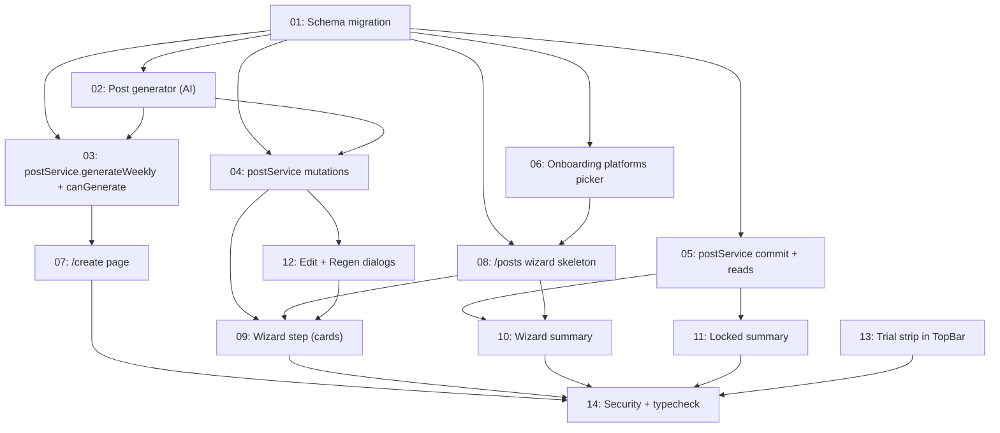

# Phase 2 — Post Generation

## Overview

Wire up `postService.generateWeekly()` end-to-end so business owners answer 2 weekly questions and get 7 AI-generated posts (canonical Facebook caption + Instagram and LinkedIn text variations) reviewed via a multi-step wizard, with explicit opt-in per-network scheduling. Plus an onboarding update to capture which networks the user wants to use.

Final commit point for Phase 2 is `weekly_batches.status = "scheduling"` — Phase 4 owns the calendar, cron, and actual posting.

## Quick Links

- [Full Spec](./spec.md) — design rationale, all decisions (D1–D20), system prompt draft, error taxonomy

## Dependency Graph

## Waves

| Wave | Tasks | Description |
|---|---|---|
| 1 | 01, 13 | Schema migration + independent TopBar trial strip |
| 2 | 02, 06 | AI generator module + onboarding platforms picker |
| 3 | 03, 04, 05 | All service-layer methods (parallel) |
| 4 | 07, 08, 12 | `/create` page + wizard skeleton + dialogs (parallel) |
| 5 | 09, 10, 11 | Wizard internals (parallel) |
| 6 | 14 | Security pass + lint/typecheck/build audit |

## Task Status

### Wave 1 — foundation
- [x] [task-01-schema-migration](./tasks/task-01-schema-migration.md) — migration 0003: `posts` columns, `post_variations`, `post_selections`, BatchStatus union
- [x] [task-13-trial-strip](./tasks/task-13-trial-strip.md) — `<TrialStrip />` in `DashboardTopBar`

### Wave 2 — AI module + onboarding
- [x] [task-02-post-generator](./tasks/task-02-post-generator.md) — `src/lib/ai/post-generator.ts` (Anthropic + tool + Zod)
- [x] [task-06-onboarding-platforms](./tasks/task-06-onboarding-platforms.md) — onboarding form writes `profiles.platforms`

### Wave 3 — service layer
- [x] [task-03-post-service-generate](./tasks/task-03-post-service-generate.md) — `generateWeekly` + `subscriptionService.canGenerate` + `hasAnyBatch`
- [x] [task-04-post-service-mutations](./tasks/task-04-post-service-mutations.md) — `update`, `regenerate`, `selectForNetwork`, `deselectForNetwork`
- [x] [task-05-post-service-commit](./tasks/task-05-post-service-commit.md) — `scheduleMyPick`, `stopBatch`, `getBatchForReview`, `getCurrentBatch`

### Wave 4 — top-level UI surfaces
- [x] [task-07-create-page](./tasks/task-07-create-page.md) — form mode + gated mode + trial note + server action
- [x] [task-08-posts-wizard-skeleton](./tasks/task-08-posts-wizard-skeleton.md) — `<NetworkWizard />` + `<WizardNav />` + step routing
- [x] [task-12-dialogs](./tasks/task-12-dialogs.md) — `<EditDialog />` + `<RegenerateDialog />`

### Wave 5 — wizard internals
- [x] [task-09-posts-wizard-step](./tasks/task-09-posts-wizard-step.md) — `<WizardStep />` 7-card grid, checkbox, edit/regen wiring, stale-variation note
- [x] [task-10-posts-wizard-summary](./tasks/task-10-posts-wizard-summary.md) — `<WizardSummary />` + Schedule my pick
- [x] [task-11-posts-locked-summary](./tasks/task-11-posts-locked-summary.md) — `<LockedSummary />` for scheduling + cancelled

### Wave 6 — audit
- [x] [task-14-security-and-typecheck](./tasks/task-14-security-and-typecheck.md) — ownership audit + lint/typecheck/build pass
