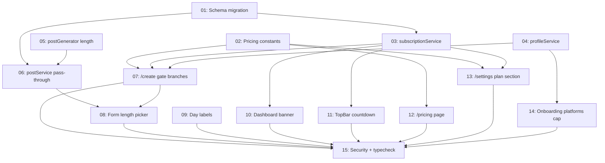

# Phase 3 — Subscription Gating

## Overview

Wire up plan-aware generation gating. Trial users keep the Phase 2 1-batch-lifetime cap. Starter ($9.99/mo) gets 1 batch/week and 2 of 3 platforms. Pro ($19.99/mo) gets 1 batch/week, all 3 platforms, and a per-batch post-length choice (short / medium / long). Reset is rolling 7 days from the last batch's `createdAt`; plan change mid-cycle grants a fresh batch immediately; downgrade/cancel mid-cycle leaves the in-flight batch alone.

No credits, no PAYG, no payment integration — Phase 3 covers the gates and UI only. Plan changes happen via direct DB mutation in Phase 3 (manual via Drizzle Studio or the dev-only `subscriptionService.setPlan` helper). Polar / real upgrade flow lands in Phase 5.

## Quick Links

- [Full Spec](./spec.md) — design rationale, all decisions (D1–D14), error taxonomy, DoD checklist

## Dependency Graph

## Waves

| Wave | Tasks | Description |
|---|---|---|
| 1 | 01, 02 | Schema migration + pricing constants (foundation, parallel) |
| 2 | 03, 04, 05, 06 | Service-layer extensions (parallel after Wave 1) |
| 3 | 07, 08, 09, 10, 11, 12, 13, 14 | UI surfaces (parallel — task-08 depends on 07's structure but they can be drafted together) |
| 4 | 15 | Security + lint/typecheck/build audit |

## Task Status

### Wave 1 — foundation
- [ ] [task-01-schema-migration](./tasks/task-01-schema-migration.md) — migration 0005: `weekly_batches.post_length` + `subscriptions.plan_changed_at` + backfill
- [ ] [task-02-pricing-constants](./tasks/task-02-pricing-constants.md) — `src/lib/pricing.ts`

### Wave 2 — service layer
- [ ] [task-03-subscription-service](./tasks/task-03-subscription-service.md) — extend `canGenerate` (4-reason union), add `nextResetAt`, dev-only `setPlan`
- [ ] [task-04-profile-service](./tasks/task-04-profile-service.md) — Starter platform-cap enforcement
- [ ] [task-05-post-generator-length](./tasks/task-05-post-generator-length.md) — `postLength` directive in AI prompt
- [ ] [task-06-post-service-pass-through](./tasks/task-06-post-service-pass-through.md) — `generateWeekly` accepts + persists `postLength`

### Wave 3 — UI surfaces
- [ ] [task-07-create-gate-branches](./tasks/task-07-create-gate-branches.md) — `/create` page + `<QuotaGatedScreen />`
- [ ] [task-08-create-form-length-picker](./tasks/task-08-create-form-length-picker.md) — Pro-only post-length picker
- [ ] [task-09-day-labels](./tasks/task-09-day-labels.md) — `<DayLabel />` on wizard, summary, locked-summary cards
- [ ] [task-10-dashboard-banner](./tasks/task-10-dashboard-banner.md) — `<NextBatchBanner />` on `/dashboard`
- [ ] [task-11-topbar-countdown](./tasks/task-11-topbar-countdown.md) — quota countdown pill for paid users
- [ ] [task-12-pricing-page](./tasks/task-12-pricing-page.md) — 3 plan cards, "Coming soon" CTAs
- [ ] [task-13-settings-plan-section](./tasks/task-13-settings-plan-section.md) — read-only plan + status + reset
- [ ] [task-14-onboarding-platforms-cap](./tasks/task-14-onboarding-platforms-cap.md) — Starter 2-platform UI cap

### Wave 4 — audit
- [ ] [task-15-security-and-typecheck](./tasks/task-15-security-and-typecheck.md) — ownership + bypass + downgrade tests + lint/typecheck/build

## Locked decisions (full text in [spec.md § 1](./spec.md))

- Plans: `free_trial`, `starter`, `pro`. No PAYG, no credits.
- Pricing: Starter $9.99/mo · Pro $19.99/mo. Monthly only — annual arrives in Phase 5.
- Reset: rolling 7 days from `batch.createdAt`.
- Trial: pauses on day 7; 1 batch lifetime cap stays.
- Starter: 2 of 3 platforms, set on `profile.platforms`. Pro: pick 1–3 freely.
- Post-length: per-batch. Pro-only choice. Starter/Trial default to "medium".
- Day 1 = batch generation day in user's timezone.
- Upgrade mid-week = fresh batch. Downgrade/cancel = in-flight batch preserved, no refund.
- In-app reminder only (dashboard + TopBar). No email.

## Deliberately deferred

- Image extras (Pro 3-image, "Use my face", $0.50 regen) → image phase
- 2x/day posting → Phase 4 scheduling
- Smart trial-conversion screen → image phase
- Email reminders → Phase 4
- Multi-theme / monthly batch rotation → Phase 4
- Plan upgrade UI / Polar / Stripe → Phase 5
- Annual pricing toggle → Phase 5
- Trial-abuse hardening → `specs/phase-3-backlog.md` (pre-launch)
