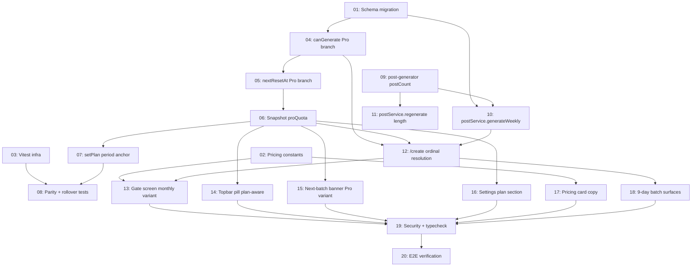

# Phase 4 Section A — Pro Monthly Quota

## Overview

Change Pro from "1 batch per rolling 7 days" to "4 batches per rolling 30-day period." Pro gets no wait between batches — all 4 can land same-day. Within a period, batches 1–3 are 7-post; batch 4 is automatically 9-post (filling the remaining 9 days, total 30 posts). Trial and Starter behavior unchanged. `regenerate` becomes batch-length-aware (closes a Phase 3 follow-up). Vitest is introduced for the spec's mandated parity test.

Section B (themed sequential batches) is deferred — depends on scheduling infrastructure that does not exist yet.

## Quick Links

- [Full Spec](./spec.md) — design rationale, all decisions (D-A1–D-A19), error taxonomy, DoD checklist
- [Source spec (draft)](../phase-4-pro-monthly-quota-spec.md) — original spec covering Sections A + B

## Dependency Graph

## Waves

| Wave | Tasks | Description |
|---|---|---|
| 1 | 01, 02, 03 | Foundations (parallel within wave) |
| 2 | 04 → 05 → 06 → 07 → 08 | Service layer — **sequential, all touch `subscription-service.ts`** |
| 3 | 09, 10, 11, 12 | Batch-length plumbing (10/11/12 parallel after 09) |
| 4 | 13, 14, 15, 16, 17, 18 | UI surfaces (parallel within wave) |
| 5 | 19, 20 | Audit + manual E2E (sequential) |

## Task Status

### Wave 1 — foundations
- [ ] [task-01-schema-migration](./tasks/task-01-schema-migration.md) — migration 0006: `subscriptions.period_start_date` + `weekly_batches.batch_ordinal_in_period` + backfill
- [ ] [task-02-pricing-constants](./tasks/task-02-pricing-constants.md) — Pro pitch/features copy + new constants
- [ ] [task-03-vitest-infra](./tasks/task-03-vitest-infra.md) — install Vitest, wire scripts, scaffold test file

### Wave 2 — service layer (sequential — same file)
- [ ] [task-04-cangenerate-pro-branch](./tasks/task-04-cangenerate-pro-branch.md) — split branch 5 by plan; add `monthly_cap_active` reason
- [ ] [task-05-nextresetat-pro-branch](./tasks/task-05-nextresetat-pro-branch.md) — mirror Pro branching in `nextResetAt`
- [ ] [task-06-snapshot-proquota](./tasks/task-06-snapshot-proquota.md) — extend `SubscriptionStateSnapshot` with `proQuota`
- [ ] [task-07-setplan-period-anchor](./tasks/task-07-setplan-period-anchor.md) — set `period_start_date` on Pro transitions
- [ ] [task-08-parity-rollover-tests](./tasks/task-08-parity-rollover-tests.md) — Vitest suite asserting `canGenerate`/`nextResetAt` agreement

### Wave 3 — batch-length plumbing
- [ ] [task-09-post-generator-postcount](./tasks/task-09-post-generator-postcount.md) — parameterise `postCount` in generator + tool schema + Zod
- [ ] [task-10-postservice-generate-length](./tasks/task-10-postservice-generate-length.md) — accept `postCount` + `batchOrdinalInPeriod`, persist, forward
- [ ] [task-11-postservice-regenerate-length](./tasks/task-11-postservice-regenerate-length.md) — read `batch.totalPosts`, pass into `regenerateOne`
- [ ] [task-12-create-route-ordinal](./tasks/task-12-create-route-ordinal.md) — compute ordinal + `postCount` server-side, pass to service

### Wave 4 — UI surfaces
- [ ] [task-13-gate-screen-monthly-variant](./tasks/task-13-gate-screen-monthly-variant.md) — `<QuotaGatedScreen variant="monthly_quota" />` + page switch
- [ ] [task-14-topbar-pill-plan-aware](./tasks/task-14-topbar-pill-plan-aware.md) — `<QuotaCountdownPill />` Pro rendering
- [ ] [task-15-banner-pro-variant](./tasks/task-15-banner-pro-variant.md) — `<NextBatchBanner />` Pro copy branch
- [ ] [task-16-settings-plan-section-pro](./tasks/task-16-settings-plan-section-pro.md) — `<PlanSection />` period usage line
- [ ] [task-17-pricing-card-copy](./tasks/task-17-pricing-card-copy.md) — verify `/pricing` Pro card reflects new strings
- [ ] [task-18-nine-day-batch-surfaces](./tasks/task-18-nine-day-batch-surfaces.md) — wizard/summary/locked iterate `totalPosts` not 7

### Wave 5 — audit + verification
- [ ] [task-19-security-and-typecheck](./tasks/task-19-security-and-typecheck.md) — grep audits + lint/typecheck/build
- [ ] [task-20-e2e-verification](./tasks/task-20-e2e-verification.md) — manual end-to-end + verification.md

## Locked decisions (full text in [spec.md § 1](./spec.md))

- Pro: 4 batches per rolling 30 days, no wait between batches, batches 1–3 = 7 posts, batch 4 = 9 posts.
- Starter: unchanged (1 batch / 7-day rolling, 7 posts).
- Trial: unchanged (1 batch lifetime, 7-day trial, 7 posts).
- Rollover computed in pure JS, never persisted on read. `period_start_date` is the immutable anchor.
- Cancelled batches count toward the 4 (consistent with Phase 3 D12).
- `monthly_cap_active` introduced as a distinct reason code from `weekly_cap_active`.
- `regenerate` becomes length-aware (closes Phase 3 follow-up, required for 9-post batches).
- Ordinal stored on `weekly_batches.batch_ordinal_in_period`, not re-derived on read.
- `setPlan(_, "pro")` from non-Pro sets `period_start_date = now()`.
- `SubscriptionStateSnapshot.proQuota` added for UI consumers — no extra DB round-trip.

## Deliberately deferred

- **Section B — themed sequential batches** → blocked on scheduling infrastructure
- **Payment / Polar / upgrade UI** → Phase 5
- **Annual plans** → Phase 5
- **Removing `postsUsedThisMonth` / `regenerationsDuringTrial`** → out of scope
- **Email reminders** → Phase 4 notifications
- **Multi-business / team plans** → Phase 5+
