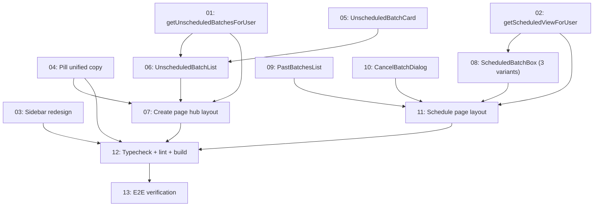

# Scheduled Page & Create Posts Flow Redesign (Stage-1)

## Overview

Redesign the sidebar and the two surfaces users touch most: the Create Posts hub (where unscheduled batches live until they're locked in) and the Scheduled page (color-coded boxes showing batches in the current 30-day quota window, plus a collapsible Past Batches list).

Solves the multi-batch confusion that surfaced once Pro shipped 4 batches per 30 days — today there's no way to tell which batch you're viewing or find earlier ones.

**Stage-1 scope**: UI/navigation only. Batch state is derived from `weeklyBatches.status` alone — the `currently_posting` (emerald) box variant and the posted-vs-queued cancel split are built as dormant contracts that activate when Phase 4 (`scheduleService`) and Phase 7 (`postingService`) ship. No new Drizzle migration. No `canGenerate` changes.

Section "Soft-delete trash + 30-day auto-purge" is deferred to a separate spec — depends on background-job infrastructure that does not exist yet.

## Quick Links

- [Full Spec](./spec.md) — all decisions (D-S1–D-S17), state mapping, API, UI requirements, DoD
- [Verification runbook](./verification.md) — created by task-13

> Origin: this spec was distilled from a local planning session in plan mode. The intermediate plan file lived in the author's local `.claude/plans/` directory and is not committed.

## Dependency Graph

## Waves

| Wave | Tasks | Description |
|---|---|---|
| 1 | 01, 02 | Service layer (parallel — split file regions) |
| 2 | 03, 04 | Navigation + pill (parallel — different files) |
| 3 | 05, 06, 07 | Create Posts hub (05/06 parallel → 07) |
| 4 | 08, 09, 10, 11 | Scheduled page (08/09/10 parallel → 11) |
| 5 | 12, 13 | Audit + manual E2E (sequential) |

## Task Status

### Wave 1 — service layer (parallel)
- [ ] [task-01-post-service-unscheduled-list](./tasks/task-01-post-service-unscheduled-list.md) — add `getUnscheduledBatchesForUser(userId)`
- [ ] [task-02-post-service-scheduled-view](./tasks/task-02-post-service-scheduled-view.md) — add `getScheduledViewForUser(userId)` with dormant Stage-1 zeros

### Wave 2 — navigation + pill (parallel)
- [ ] [task-03-sidebar-redesign](./tasks/task-03-sidebar-redesign.md) — drop "My Posts", rename "Schedule" → "Scheduled"
- [ ] [task-04-pill-unified-copy](./tasks/task-04-pill-unified-copy.md) — Trial/Starter/Pro copy table; Trial-used links to `/pricing`

### Wave 3 — Create Posts hub
- [ ] [task-05-unscheduled-batch-card](./tasks/task-05-unscheduled-batch-card.md) — single card with state chip + network counts + Open CTA
- [ ] [task-06-unscheduled-batch-list](./tasks/task-06-unscheduled-batch-list.md) — list wrapper with top buttons
- [ ] [task-07-create-page-hub-layout](./tasks/task-07-create-page-hub-layout.md) — wire list above existing GenerateForm; collapse-by-default rule

### Wave 4 — Scheduled page
- [ ] [task-08-scheduled-batch-box](./tasks/task-08-scheduled-batch-box.md) — color-coded box with all three derived-state variants
- [ ] [task-09-past-batches-list](./tasks/task-09-past-batches-list.md) — collapsible compact row list with empty state
- [ ] [task-10-cancel-batch-dialog](./tasks/task-10-cancel-batch-dialog.md) — confirm dialog with dormant split-block contract
- [ ] [task-11-schedule-page-layout](./tasks/task-11-schedule-page-layout.md) — orchestrator + empty state, replaces placeholder

### Wave 5 — audit + verification
- [ ] [task-12-typecheck-lint-build](./tasks/task-12-typecheck-lint-build.md) — `pnpm lint && pnpm typecheck && pnpm build` all exit 0
- [ ] [task-13-e2e-verification](./tasks/task-13-e2e-verification.md) — manual runbook covering every plan × state combination + dormant-variant smoke

## Locked decisions (full text in [spec.md § 1](./spec.md))

- Sidebar: Create Posts → Image Library → Scheduled → Settings. "My Posts" removed.
- Create Posts is a hub: stacked cards for `reviewing` + `cancelled` batches above existing form/gated screen.
- Scheduled is plan-agnostic: boxes appear only when batches exist; layout identical across Trial/Starter/Pro.
- Stage-1 derives state from `weeklyBatches.status` alone — no `scheduled_posts` reads.
- Cancel dialog Stage-1 copy: `"All N posts will be cancelled. The batch will return to Create Posts so you can edit and re-schedule."` Dialog accepts `alreadyPostedCount` (default 0) + `queuedCount` (default totalPosts) as a dormant contract for Phase 7.
- Past Batches windowed against `subscriptions.periodStartDate` — same anchor for all plans.
- Pill copy: Trial = `"Trial · 1 batch"` → `"Trial used · Upgrade"` (link). Starter/Pro = `"N batches left"` → `"Resets in Nd"`.
- Batch ordinal: Pro shows `BATCH 1..4`, Trial/Starter just `BATCH`.

## Deliberately deferred

- **Soft-delete trash + auto-purge** → blocked on background-job infrastructure; separate spec
- **Phase 4 — scheduling service** → cron, calendar UI, time-slot picker, auto-schedule. New `<ScheduledBatchBox />` is the visual home when those land
- **Phase 7 — posting service** → Facebook/Instagram/LinkedIn API calls, OAuth, retry. Dormant emerald box and split cancel dialog are the contract
- **Route renames** → `/create`, `/posts`, `/schedule` keep their pathnames
- **Schema migrations** → none in this spec
- **`canGenerate` changes** → none in this spec
